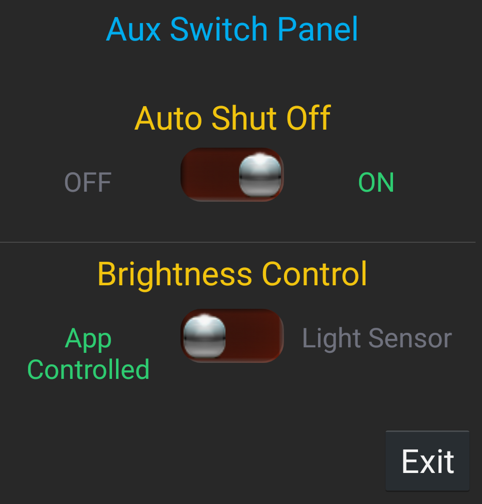
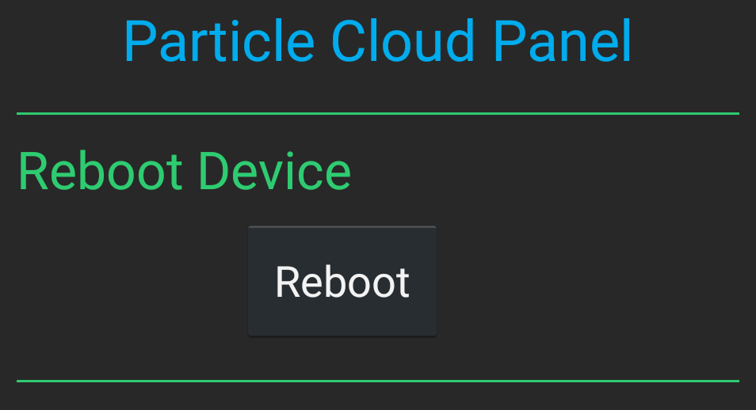

Do you like Spark Pixels? Consider donating.

<span class="badge-paypal"><a href="https://www.paypal.com/cgi-bin/webscr?cmd=_s-xclick&hosted_button_id=RR57XN8E4KAJ2" title="Donate to this project using Paypal"></a></span>
# [Spark Pixels](https://play.google.com/store/apps/details?id=kc.spark.pixels.android)
Another Neopixel project controlled by the Spark Core from [Particle devices](http://docs.particle.io/) (formerly Spark). This repository contains the source code for the Spark Pixels Android App and firmware. You will need an Android device, a Spark Core or Particle Photon, and a strip of Neopixels. Spark Pixels is expandable. The app and firmware have been designed so that if you want to add a new LED sequence (aka mode) for your Neopixels, you only have to re-flash your Particle device. The Android app reads in the list of available modes from the device every time the app is launched. The Android app code should never need to be updated

## Outline
* [What firmware do I use?](https://github.com/sparcules/Spark_Pixels#what-firmware-do-I-use)
* [Community](https://github.com/sparcules/Spark_Pixels#community)
* [Usage](https://github.com/sparcules/Spark_Pixels#usage)
* [Flashing the Firmware](https://github.com/sparcules/Spark_Pixels#flashing-the-firmware)
* [Adding a new Mode to the Firmware](https://github.com/sparcules/Spark_Pixels#adding-a-new-mode-to-the-firmware)
* [Adding a new Aux Switch to the Firmware](https://github.com/sparcules/Spark_Pixels#adding-a-new-aux-switch-to-the-firmware)
* [Adding Time Zone Sync feature to the Firmware](https://github.com/sparcules/Spark_Pixels#adding-time-zone-sync-feature-to-the-firmware)
* [How to add Reboot option](https://github.com/sparcules/Spark_Pixels#how-to-add-reboot-option)
* [Firmware](https://github.com/sparcules/Spark_Pixels#firmware)
* [Limitations](https://github.com/sparcules/Spark_Pixels#limitations)
* [Android App](https://github.com/sparcules/Spark_Pixels#android-app)
* [Android App Building](https://github.com/sparcules/Spark_Pixels#android-app-building)
* [Android App Requires TI SmartConfig Library](https://github.com/sparcules/Spark_Pixels#android-app-requires-ti-smartconfig-library)
* [Key Classes](https://github.com/sparcules/Spark_Pixels#key-classes)
* [Hardware Implementation](https://github.com/sparcules/Spark_Pixels#[hardware-implementation)
* [Open Source Licenses](https://github.com/sparcules/Spark_Pixels#open-source-licenses)

## What firmware do I use?
* For single strip or Neopixel rings, get the [firmware here](https://github.com/sparcules/Spark_Pixels/tree/master/Firmware).
* For the [L3D Cube](http://lookingglassfactory.com/), get Werner's [firmware here](https://github.com/wmoecke/Spark_Pixels/blob/master/Firmware/SparkPixels.ino). Or flash through [Cubetube here](http://www.cubetube.org/gallery/newestFirst/1438/).
* Have a 2D Neopixel Matrix and want scrolling text? Sorry, this sketch hasn't been developed yet. But you can comb through Werner's sketch for the L3D Cube to get example code for scrolling text.
* See [Flashing the Firmware](https://github.com/sparcules/Spark_Pixels#flashing-the-firmware) below for instructions on how to flash through Particle's web IDE.


## What's New in [Spark Pixels](https://play.google.com/store/apps/details?id=kc.spark.pixels.android) v0.2.7
* Fixed Auto Sync Time Zone bug when observing DST - Daylight Savings Time. The Particle Cloud doesn’t currently support updating the time to reflect DST. The time zone offset value is now adjusted to compensate for DST so that your Particle device is always running the correct time.
* Renamed Get Particle Variable (debug) feature to Particle Cloud Panel.
* Added extra Debug/Tinker features in the Particle Cloud Panel.
	- You can now send command arguments to Particle Functions. Select the function, enter your argument text and hit the "Set 		  Function" button.
	- Added a Reboot button. Lazy and don't want to get up to hit the reset button on your Particle device? Just open the Particle 	  Cloud Panel in the app and hit the Reboot button instead. See [How to add Reboot](https://github.com/sparcules/Spark_Pixels#how-to-add-reboot-option) section below to add it to your existing code.


## What's New in [Spark Pixels](https://play.google.com/store/apps/details?id=kc.spark.pixels.android) v0.2.5
* Removed the Auto Shut Off control from the settings menu. Don’t freak, see next enhancement below :)
* Added Aux Switch Panel - used to turn things on or off or switch between two options. i.e. switch between using a light sensor or the app to set LED brightness. Turning the Auto Shut Off on or off has migrated to use this feature.
* Added menu and refresh icons to the main screens.
* Added menu option for each device that allows renaming and changing the (in app) color of the device.
* Added product identification under each device name (either Core or Photon).
* Enhanced the Rename Device feature.
* Removed the (confusing) need to set the Pixel Drivers in the settings menu. 
* The app will now auto detect your devices that are online and loaded with the Spark Pixels firmware. This happens on startup or when pressing the reload icon. Devices that are recognized as having the the correct firmware will show the Spark Pixels icon next to the device name.
* Added Auto Sync option in the settings menu. Checking this box will Sync the Time Zone Offset captured from your Android device on startup. This is enabled by default.


## What's New in [Spark Pixels](https://play.google.com/store/apps/details?id=kc.spark.pixels.android) v0.2.0
* Now supporting the [Looking Glass L3D Cube](http://lookingglassfactory.com/)! Get Werner's [firmware here](https://github.com/wmoecke/Spark_Pixels).
* Switch modes without having to update color/parameter settings a second time. To change color/parameters, tap on the color/parameter icon to update.
* Added switch options to enable/disable extra features within a mode. Switch options are configured in the sketch.
* Added a text input option for scrolling text - useful for Neopixel grids. 
* Added support for more connected Neopixels! (up to 10 devices)
* Added Auto Shut Off control. Enable or disable your Neopixels auto turning off. Turn off times are configured in the sketch. Your sketch must be updated with the latest firmware to enable this option. See the github page for more info.
* Added Get Cloud Variable option in the menu for debugging or other configurable cloud variables. This is a really neat feature, the dialog will populate a drop down box with all of your published cloud variables.

Error after updating from v0.0.3?
If you are getting the error: "No response from Core". Try uninstalling the app and re-installing.


## Community
I created a facebook page for users of the Spark Pixels Android app and Particle firmware to: 
- Post Pictures and/or Videos of your setup
- Share new modes that you've created
- Post any troubleshooting help you may need
- Suggestions or improvements to the app or firmware

https://www.facebook.com/Spark-Pixels-1716703048549907/timeline/


## Usage
1. Install the Android app on your Android device from [here](https://play.google.com/store/apps/details?id=kc.spark.pixels.android).
2. Launch the app and login to your Particle.io account.
3. If not already done, connect your Spark Core or Photon device to your home WiFi network.
    - **Spark Core** users: Use this app to connect your Core 
    - **Photon** users: Use the Particle app found [here](https://play.google.com/store/apps/details?id=io.particle.android.app).
4. A welcome screen should appear. The message should tell you how many devices you have that are online and programmed with the Spark Pixels firmware.
5. If you haven’t done so already, load the SparkPixels firmware onto your device - see Flashing the Firmware below.
6. If you have more than one Particle device it is recommended to navigate to the settings menu and select the **Default Driver**. The app will auto-open this device on startup. This allows for a faster start up. 
7. Enjoy controlling your Neopixels from your Android device.


## Flashing the Firmware
1. Go to the Particle web IDE (https://build.particle.io/build/) 
2. Click on **CREATE NEW APP** and name it what you wish. I call mine *UNDERCABINETPIXELS*.
3. Add the **NEOPIXEL** library, it's best to do this step now. Click on the libraries icon and select **NEOPIXEL** (it should be at the top of the list). Then click on **INCLUDE IN APP**. Select the app you just created from the list. Then click on **ADD TO THIS APP**.
4. Copy and paste the *SparkPixels.ino* code into the app, replacing all existing text.
5. Update the ***PIXEL_CNT*** and ***PIXEL_PIN*** (near the top of the code) for your setup.
6. Flash your Core and enjoy!


## Adding a new Mode to the Firmware
1. Add your new mode function to the firmware code.
2. Create a name for your new mode and add it to the list under *Mode ID Defines*. It's actually of a *const uint8_t* type. Try to keep the number of characters to a minimum. See Limitations below for explanation. For demonstration purposes, let's add two new modes that we'll name as NEW_MODE_1 and NEW_MODE_2. (See code example below).
 
 ```
   /* ======================= ADD NEW MODE ID HERE. ======================= */
   // Mode ID Defines
   const uint8_t DIGI            = 22;
   const uint8_t NEW_MODE_1      = 23;
   const uint8_t NEW_MODE_2      = 24;
 ```
 
3. Add that same name to the **modeStruct[]** array. The previously defined name must be used as the modeID parameter. I also use the same name as the modeName string. (See next code example below). 
4. Then decide how many colors you want to pass to your new mode, max is 6. (The Android app will force you to select this many different colors when selecting this mode). i.e. The NEW_MODE_2 mode that we just created, takes 2 colors. When the user selects this mode from the android app, the app will popup a color picker dialog to let the user pick the desired color for to pass to the selected mode. (See next code example below).
5. Then decide how many switches you want to pass to your new mode, max is 4. For every switch that you want, you will need to add a switch title for it in the switchTitleStruct[] array. i.e. The NEW_MODE_1 mode we created, needs 4 switches. (See next code example below).
6. Then decide whether you need a text input for you new mode. This is only useful for Neopixel matrixes. i.e. The NEW_MODE_2 is setup to use a text input, so we set that column to true. (See next code example below).

 ```
   /* ======================= ADD NEW MODE STRUCT HERE. ======================= */
   modeParams modeStruct[] =
   { 
     /*     modeId           modeName 	     #Colors #Switches  textInput
      *     -------------    -------------  ------- ---------  --------   */
         {  OFF,             "OFF",             0,      0,      FALSE  },
         {  COLORALL,        "COLORALL",        1,      0,      FALSE  },
         // Insert new modes here
         {  NEW_MODE_1,      "New Mode 1",      0,      4,      FALSE  },
         {  NEW_MODE_2,      "New Mode 2",      2,      0,      TRUE   },
   };
 ```
 
7. If your mode is using Switches, add that same modeID name to the **switchTitleStruct[]** array. The number of switch titles entered here should match the number entered in the modeStruct[] array above. i.e. Lets look at the NEW_MODE_1 example below. We entered 4 in the #Switches column above. So now we need to enter in titles for the 4 switches below.

 ```
   /* ======================= ADD ANY REQUIRED SWITCH TITLES HERE ======================= */
   switchParams switchTitleStruct[] = 
   { 
    /*    modeId           S1Title                S2Title                S3Title                S4Title 
     *    ---------------  ---------------------- ---------------------- ---------------------- ---------------------- */
	      {  DIGI,            "Random Fill",         "Fade In",             "",                    ""                }, 
	      {  NEW_MODE_1,      "Switch Title 1",      "Switch Title 2",      "Switch Title 3",      "Switch Title 4"  },
};
 ```
 
8. Add the mode name to the case statement in the runMode() and add the function call to it. i.e. Notice that NEW_MODE_2 was defined to need 2 colors above. So we pass the global variables color1 and color2 to the newModeCode() function. The variables color1 and color2 will get set by the SetMode (cloud) function when the NEW_MODE_2 mode gets selected from the app.

 ```
   int runMode(int modeID) {
       switch (modeID) {
          case NEW_MODE_1:
             newModeCode();
             break;
          case NEW_MODE_2:
             newModeCode(uint32_t color1, uint32_t color2);
             break;
       }
   }
 ```
 
Global variables controlled by the app:
* brightness - Controls light intensity
* speed - Sets the delay or the speed at which modes will sequence
* speedIndex - Index value to the speedPresets[] array which then sets the speed value
* color1, color2, color3, color4, color5, color6 - Color values selected from the app 
* switch1, switch2, switch3, switch4 - Enable/Disable extra features within a mode
* textInputString - Used to display text on Neopixel grids


## Adding a new Aux Switch to the Firmware


1. Aux Switches is your tool to turn things On or Off or to toggle between two different options. By default, the Auto Shut Off (ASO) feature has migrated to use a Aux Switch.
2. Create an ID name for your Aux Switch and add it to the list under *AUX SWITCH ID Defines*. 

 ```
   /* ======================= ADD NEW AUX SWITCH ID HERE. ======================= */
   // AUX SWITCH ID Defines
   const uint8_t ASO         = 0;
   const uint8_t LIGHTSENSOR = 1;
 ```

2. Add that same name to the **auxSwitchStruct[]** array under the *auxSwitchId* column. 
3. Next enter the preferred switch state under the *auxSwitchState* column. This will be the state of the switch after a device reset. TRUE = Switch is ON, FALSE = Switch is OFF.
4. Now add a title of your switch under the *auxSwitchTitle* column. This is the title that can be seen under the Aux Switch Panel in the app.
5. Then add On and Off switch state names under the *auxSwitchOnName* and *auxSwitchOffName* columns. These names will also show up in the app under the Aux Switch Panel.

 ```
   /* ======================= ADD NEW AUX SWITCH STRUCT HERE. ======================= */
   auxSwitchParams auxSwitchStruct[] = 
   { 
     /*    auxSwitchId      auxSwitchState  auxSwitchTitle         auxSwitchOnName        auxSwitchOffName     
     *     ---------------  --------------  ---------------------- ---------------------- ------------------*/
        {  ASO,             TRUE,          "Auto Shut Off",       "ON",                  "OFF"             }, 
        {  LIGHTSENSOR,     FALSE,         "Brightness Control",  "Light Sensor",        "App Controlled"  },
   };
 ```
 
 6. It's best to create a global boolean flag to store the running state of your switches. To keep your code organized, add it under the *Local Aux Switch Flags* section.
 
  ```
   /* ========================= Local Aux Switch Flags =========================== */
   bool autoShutOff;   //Should we shut off the lights at certain times? This is toggled from the app
   bool brightnessControl;
 ```

7. Finally, let's keep the boolean flag updated in the **updateAuxSwitches** function. Add the auxSwitchId (previously defined) to the switch statement. Add the boolean flag under that case, then simply set it equal to *auxSwitchStruct[getAuxSwitchIndexFromID(id)].auxSwitchState*, and return the result. This function only updates one flag at a time. If your switch ID isn't found in this function, you will get a *Failed to Update* error in the app, possibly resulting in some squirrely results. Meaning the switch could still update but not properly show it in the app. 

  ```
   /**Update local Aux Switch variables
   int updateAuxSwitches(int id) {
    switch(id) {
        case ASO:
            return autoShutOff = auxSwitchStruct[getAuxSwitchIndexFromID(id)].auxSwitchState;
        case LIGHTSENSOR:
            return brightnessControl = auxSwitchStruct[getAuxSwitchIndexFromID(id)].auxSwitchState;
    }
    return -1;
}
  ```
  
If you're adding the Aux Switches to you're current sketch. Find these functions in the sketch under the Firmware folder and add them to your sketch:

  ```
	void makeAuxSwitchList(void)
	int updateAuxSwitches(int id)
	int getSwitchTitleStructIndex(int modeId)
	int FnRouter(String command)	// Update or add this one
  ```

Then add these lines in **setup()**:

  ```
	Particle.function("Function",      FnRouter);
	makeAuxSwitchList();
  ```
  
  
## Adding Time Zone Sync feature to the Firmware
1. Create this global variable near the top of your sketch and set it equal to the already defined TIME_ZONE_OFFSET.

  ```
  int timeZone = TIME_ZONE_OFFSET;
  ```
    
2. Set the Time Zone API call to the timeZone Variable in **setup()**

  ```
  Time.zone(timeZone);  //set time zone
  ```

3. Add the update code to the **FnRouter** cloud function
 
  ```
  // Set time zone offset
  if(command.substring(beginIdx, colonIdx)=="SETTIMEZONE") {
      //Expect a string like this: SETTIMEZONE:-6
      timeZone = command.substring(colonIdx+1).toInt();
      Time.zone(timeZone);
      return timeZone;
  }
  ```
4. Make sure the Auto Sync option is checked in the settings menu in the app
5. Enjoy never having to manually set Daylight Savings Time again :)


## How to add Reboot option


1. Declare a boolean flag near the top of your sketch.

  ```
  bool resetFlag;
  ```
  
2. Initialize the variable in **setup()**
 
  ```
  resetFlag = false;
  ```

3. Look for the flag to be set in **loop()**

  ```
  if(resetFlag) {
  	resetFlag = false;
        delay(100); //Need this here otherwise the Cloud Function returned response is null
        System.reset();
  }
  ```

4. Add the trigger code to the **FnRouter** cloud function

  ```
  else if(command.equals("REBOOT")) {
        resetFlag = true;
        stop = TRUE;
        return 1;
  }
  ```


## Firmware
All the mode information is defined in the **modeStruct[]** and **switchTitleStruct** arrays. The setup routine calls makeModeList() that assembles all the info into Particle CLoud String Variables **modeList** and **modeParmList**. Yes, I know there is an 'a' missing from Param, Particle cloud names can only be up to 12 characters in length. The parameter info is assembled semicolon delimited. i.e. the modeParmList String would start out like this: *N;N;C:1;C:4;C:1,S:2,"Smooth""Peaks";C:1,T:;* - Always end with a semicolon.

modeParmList Key:
* N - NULL, no extra parameters are needed for this mode
* C:# - Number of Colors, # = 1-6
* S:# - Number of Switches, # = 1-4
* T:  - A Text Input is required
    
The modeList String is assembled semicolon delimited to match that of the modeParmList String. modeList only contains the mode name titles. i.e. - *OFF;NORMAL;COLORALL;ZONE;SPECTRUM;MESSAGE;* Every indexed position in modeList will have a corresponding entry in modeParmList.
Feel free to remove any modes you don't care to have. You can simply comment out the line for the mode in the **modeStruct[]** array.

I have my Neopixels installed under my cabinets. So, I wanted to be able to set each cabinet to a different color. I call this mode ZONE. If you care to use the ZONE mode, you may need to add or subtract the number of colors (1 for each zone) you have setup. The max allowed is 6. You will also need to edit the start and end pixel defines under the *ZONE mode Start and End Pixels* section.

FYI on the CHASER mode, I wanted my chaser path to be a little bit different than the actual wired path of the LEDs. So I added a CHASER_LENGTH define and some extra Start and End defines under the *CHASER mode specific Start and End Pixels* section.

There are 9 preset speeds define by the **speedPresets** int array. The Android app passes an index to this array. Feel free to change the speed values to your liking. I have added a speedFactor variable to some of my new modes to increase the delay.


## Limitations
Spark String Variables have a max length of 622 bytes. This will limit the number of modes you can create since the modes get populated into the modeList String variable. Based off the average number of characters I currently have, I estimated a max number of modes to be 69. I really can't imagine I'll ever have 40 or 50 modes. So, I don't see this being an issue. I do try to keep the number of characters in my mode names shorter just to be safe.


## Android App
The app has been developed in Eclipse. The app is based off of the Spark Core App Thermostat: SCAT (https://github.com/RolfHut/ThermosApp) which is heavily based on the official Spark app for android. The source code for that app can be found at https://github.com/spark/android-app. The whole view has been revamped to control the Neopixel brightness, speed and mode. Upon loading the app view, the app acquires these Spark Variables from the Core: brightness, speed and a comma delimited String called modeList. Once acquired, the brightness and speed slider bars are updated per the current Spark Core values. The modeList String is parsed out to populate a list view to display all of the available modes programmed into the Core. The modeList String also holds the number of colors each mode needs to run. Some modes need 1 color to operate, some modes need more, some modes need none. The user will select the desired color from a color picker dialog in the app. 

I have a temperature sensor inside my project box that houses the Spark Core and the +5V power supply. The temp reading can be displayed in the app view. The temperature reading view can be turned on or off in the settings found in the app menu.

The delay or speed of the Neopixels is controlled by a slider bar in the app. The speed is setup as preset settings that index the speedPresets array in the Firmware. The value sent to the Core is a numerical value from 0-8. The speed presets have default names, but can be changed to your liking in the settings page.

The list view of the modes will not populate unless it gets the modeList cloud variable from the Core and you have to set the Spark Core Neopixel Driver in the settings page of the app. If you have more than one Core (or Photon) registered, the app will always default to selecting this device from your list of Cores when the app launches.

## Android App Building
1. In Eclipse, go to File --> Import, and under the Android "folder", click "Existing Android Code into workspace", then click Next
2. Click Browse, select the dir where you cloned the repo, and click OK
3. You should now see two projects under the "Projects to Import" header: "SparkPixels" and "Fontify".  Click on Finish.
4. In the SparkPixels app, create the file ```res/values/local_build.xml``` with the following contents:

```
    <?xml version="1.0" encoding="utf-8"?>
    <resources>
        <string name="spark_token_creation_credentials">spark:spark</string>
    </resources>
```
_(You could actually put any valid HTTP Basic Auth string where it says ```spark:spark```; these values aren't currently used, but they must be present.)_

After this, you might also need to do a refresh and/or clean on the SparkPixels project, because Eclipse. ;-)


## Android App Requires TI SmartConfig Library
You must add smartconfiglib.jar to the `SparkPixels/libs` directory.

To get the SmartConfig library, go to the
[CC3000 Wi-Fi Downloads](http://processors.wiki.ti.com/index.php/CC3000_Wi-Fi_Downloads)
page. Search the page for the Android SmartConfig Application.
Download and unpack the app, which will require Windows. :-/
You can find smartconfiglib.jar in the libs directory of TI's app.


## Key Classes
If you want to know where the action is in the app, look at:
* PixelFragment: handles the main view and Spark Pixel control
* SimpleSparkApiService: an IntentService which performs the actual HTTP calls to talk to the Spark Cloud
* ApiFacade: A simple interface for making requests and handling responses from the Spark API. If you want to work with the Spark API from Android, this is the place to start. See examples below like nameCore(), digitalWrite(), etc, for templates to work from.
* SparkCoreApp: There are a number of classes which rely on an initialization step during app startup.  All of this happens in SparkCoreApp.onCreate().


## Hardware Implementation
Firmware was originally developed on the Spark Core. I have now migrated to using a Particle Photon instead due to programming space limitations on the Core. I kept getting the red SOS LED of death telling me that I ran out of heap memory.
The Android app was developed on a Samsung Galaxy S4 phone with Android version 5.0.1. I have no guarantees on how the list view will populate with another phone or tablet.


## Open Source Licenses
Original code in this repository is licensed by Spark Labs, Inc. under the Apache License, Version 2.0. 
See LICENSE for more information.

This app uses several Open Source libraries. See SparkCore/libs/licenses for more information.


